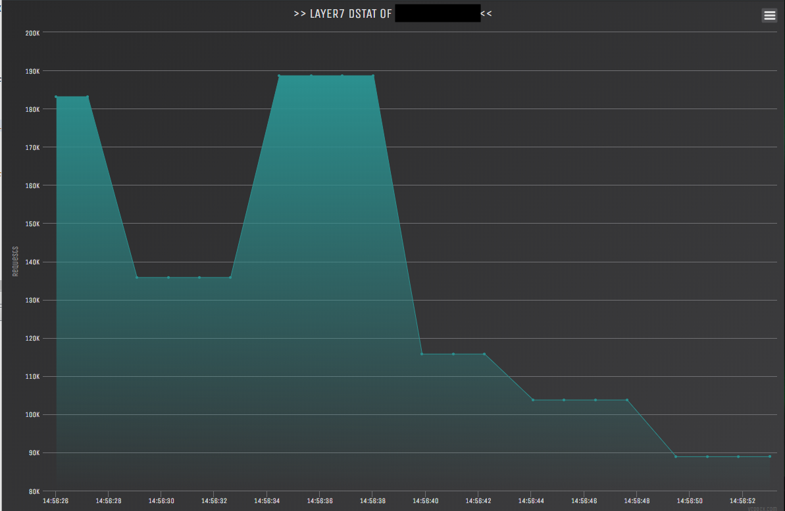

# jdos
---
A simple http flood, used to test the dstat project (https://github.com/filippofinke/dstat).

## Features
- multithread
- http
- fast

Online dstat (190k r/s peak):

# Disclaimer
Used only for demonstration purposes and on machines that I own.
By downloading this software you agree that you will only use it only on machines you own.
I'm not taking any responsibility